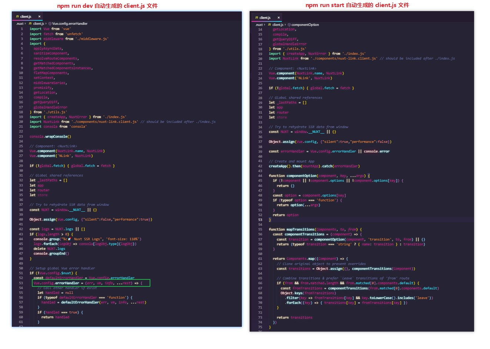
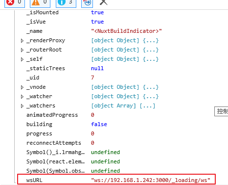
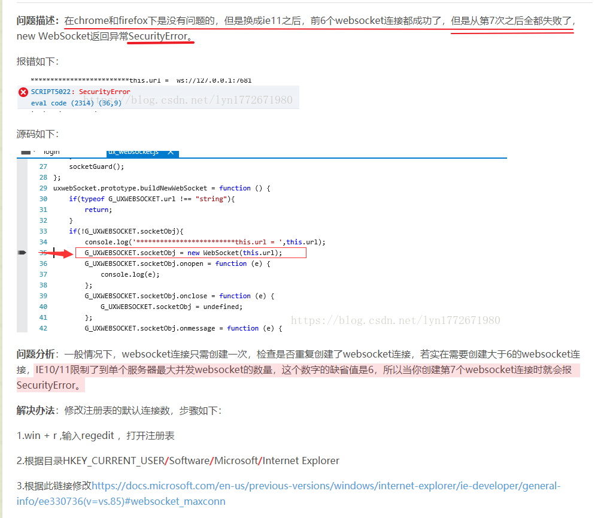

## 推断为 WebSocket 引起的

IE11 下 WebSocket 的连接数不能超过 `6` 个，超过后 new WebSocket 返回异常 `SecurityError` 。 Chrome 及 Firefox 无类似限制。

### 不同环境下的 client.js 文件

```js
// client.js

...

/**
  * 仅 npm run dev ( 开发环境 ) 时会生成
  * 因此 npm run start ( 生产环境 ) 不会出现 Security Error
  */
if (!Vue.config.$nuxt) {
  const defaultErrorHandler = Vue.config.errorHandler
  Vue.config.errorHandler = (err, vm, info, ...rest) => {
  }
}

...

```



### 控制台报错截图 ( 定位错误是由 WS 引起的重要条件 )



### 问题描述截图



参考资料：
- [
IE11下websocket报SecurityError解决办法](https://blog.csdn.net/lyn1772671980/article/details/81985335)
- [DOMException - MDN](https://developer.mozilla.org/en-US/docs/Web/API/DOMException)
- [The WebSocket API (WebSockets) - MDN](https://developer.mozilla.org/en-US/docs/Web/API/WebSockets_API)