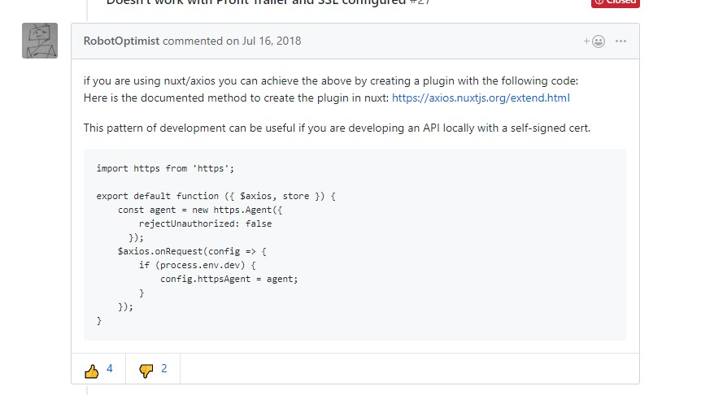

# axios Error:unable to verify the first certificate

Node 不认识请求接口的证书

解决办法：

```js
// axios.js
import https from "https";

export default function({ $axios, redirect, req, store, route, app }) {
  const agent = new https.Agent({
    rejectUnauthorized: false
  });

  $axios.onRequest(config => {
    config.httpsAgent = agent;
    ...
  });
}
```



- https://stackoverflow.com/questions/31673587/error-unable-to-verify-the-first-certificate-in-nodejs
- https://github.com/axios/axios/issues/535
- https://github.com/atom/atom/issues/16361

## 404 问题详细分析

### 原因补充

用户访问类似 `/dataset-list/.../...` `/dataset-details/...` 等路由时，由于项目采用了服务端渲染的机制 Node 服务器会向提供相关页面渲染数据的接口发起请求，例：`/data/matrix` 等

#### 生产环境

接口前置 URL 为：`https://api.data4industry.com/api/v1/`

##### 生产环境出现 404 的原因

生产环境接口证书认证手续可能存在问题，

服务端 ( Node ) 请求 https 协议的接口时会校验证书有效性，

data4industry.com 的证书可能在做验证的时候手续并不完善，

因此，出现如下错误

`Error:unable to verify the first certificate`

由于出现上述错误导致请求响应异常，因此定向到了 404 页面。

##### 做适当处理后即可解决该问题 ( 不对未完成验证的域名进行安全? 校验 )

```js
// axios.js
import https from "https";

export default function({ $axios, redirect, req, store, route, app }) {
  const agent = new https.Agent({
    rejectUnauthorized: false
  });

  $axios.onRequest(config => {
    config.httpsAgent = agent;
    ...
  });
}
```

#### 开发环境

接口前置 URL 为：`http://d4i.edge.zylliondata.local/api/v1/`

##### 开发环境未出现 404 的原因

和生产环境不同，开发环境的协议类型不为 https 因此不存在证书有效性验证的问题，

因此没出现 404 的问题。