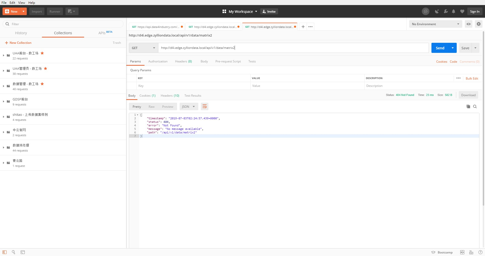

# 使用postman访问不存在的接口地址

response body

```json
{
    "timestamp": "2019-07-03T02:24:57.439+0000",
    "status": 404,
    "error": "Not Found",
    "message": "No message available",
    "path": "/api/v1/data/matrix2"
}
```

王乾、王明浩

应该返回 500，我们这边会处理成 400

那 postman 请求不存在的接口为什么会返回 404

