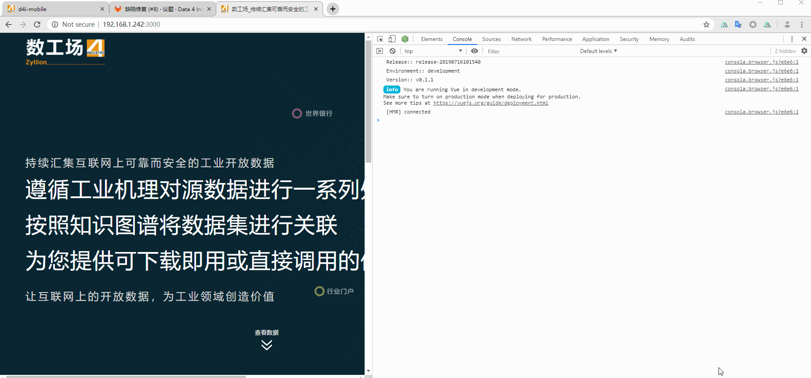

# 全局的Middleware只会在服务端走一遍



```js
// nuxt.config.js
module.exports = {
  router: {
    middleware: ['user-agent']
  }
};
```

```js
/*
 *
 * - /middleware/user-agent.js -
 * 
 */

var MobileDetect = require("mobile-detect");

export default function({ $axios, redirect, req, store, route, app }) {
  debugger;

  const baseURI = `https://m.data4industry.com`;
  const reqURI = req.url;
  const headers = req.headers;
  const userAgent = req.headers["user-agent"];

  const md = new MobileDetect(userAgent);

  const isMobileDevice = md.mobile();

  if (
    isMobileDevice &&
    !reqURI.includes("login") &&
    !reqURI.includes("binding-wechat")
  ) {
    redirect(baseURI);
  }
}
```

## 会走两遍 ?

```vue
<template>
  <div>
  </div>
</template>

<script>
export default {
  middleware: "auth"
}
</script>
```