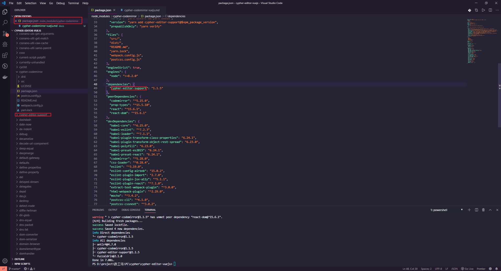
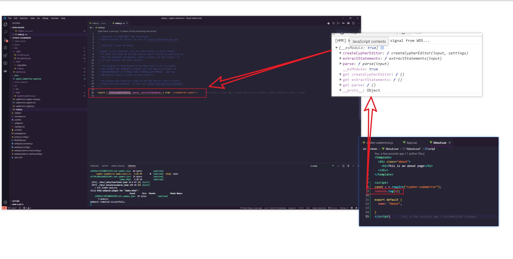
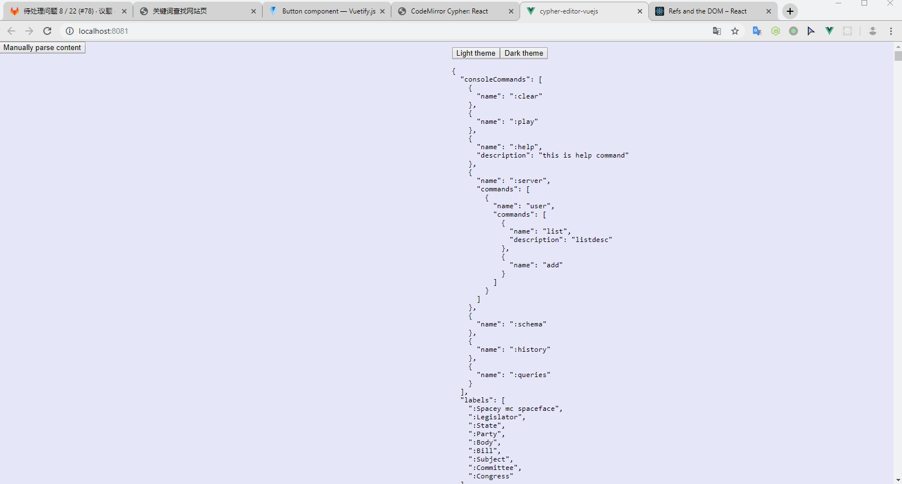
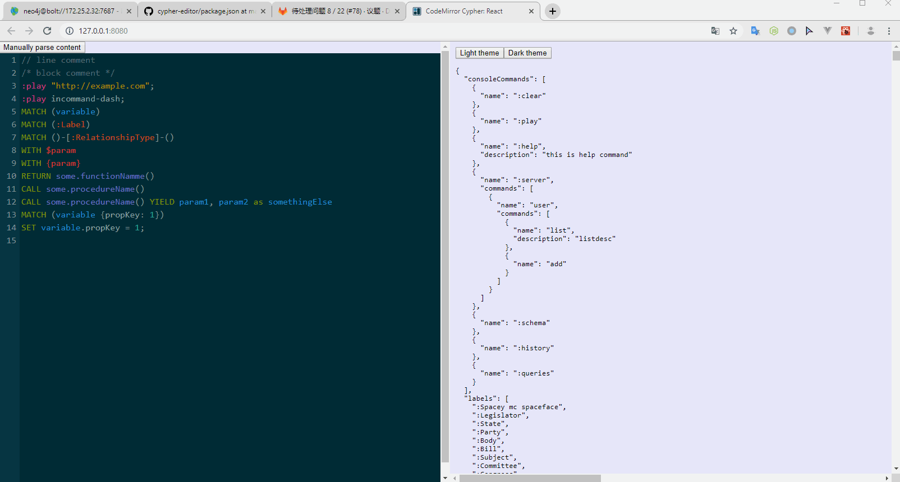

#  cypher-codemirror vuejs

## cypher-codemirror 包引用了 cypher-editor-support



## cypher-codemirror 包里暴露出来的三个方法



## 无法引入 css 文件的解决方案

```bash
yarn add postcss-import postcss-cssnext --dev
```

## 引入 codemirror 的 css 文件

```js
import "codemirror/lib/codemirror.css";
import "codemirror/addon/lint/lint";
import "codemirror/addon/lint/lint.css";
import "codemirror/addon/hint/show-hint";
import "codemirror/addon/edit/closebrackets";
import "cypher-codemirror/dist/cypher-codemirror-all.css";
import CypherCodeMirror from "@/components/CypherCodeMirror.vue";
import { neo4jSchema, codeMirrorSettings } from "@/assets/common";
```

## 成功展示编辑器

仅高亮，没补全



## 完整将 cypher-editor 的案例由 React 转为 VueJS 的

```html
<!-- App.vue -->
<style lang="scss">
html,
body {
  height: 100%;
  width: 100%;
  margin: 0;
  padding: 0;
}

body {
  background-color: lavender;
  font-family: "Merriweather", Georgia, "Times New Roman", Times, serif;
}

.container {
  width: 100%;
  height: 100%;
  margin: 0 auto;
  font-size: 16px;
}

.columns {
  display: flex;
  flex-direction: row;
  width: 100%;
  height: 100%;
  justify-content: flex-start;
  align-items: stretch;
  align-content: stretch;
}

.columns > div {
  width: 100%;
  height: 100%;
  flex: 1;
  overflow: auto;
}

.schema {
  padding: 10px;
  font-size: 10pt;
}

.CodeMirror {
  height: 100vh !important;
}
</style>


<template>
  <div id="app">
    <div class="columns">
      <div>
        <CypherCodeMirror
          :props="{ theme, settings: codeMirrorSettings, schema: neo4jSchema }"
        />
        <!-- <CypherCodeMirror :theme="theme" :settings="codeMirrorSettings" :schema="neo4jSchema" /> -->
      </div>
      <div>
        <div class="schema">
          <button @click="lightTheme">Light theme</button>
          <button @click="darkTheme">Dark theme</button>
          <pre>{{ JSON.stringify(neo4jSchema, null, 2) }}</pre>
        </div>
      </div>
    </div>
  </div>
</template>

<script>
import "codemirror/lib/codemirror.css";
import "codemirror/addon/lint/lint";
import "codemirror/addon/lint/lint.css";
import "codemirror/addon/hint/show-hint";
import "codemirror/addon/edit/closebrackets";
import "cypher-codemirror/dist/cypher-codemirror-all.css";
import CypherCodeMirror from "@/components/CypherCodeMirror.vue";
import { neo4jSchema, codeMirrorSettings } from "@/assets/common";

export default {
  name: "App",
  data() {
    return {
      theme: "cypher cypher-dark",
      codeMirrorSettings,
      neo4jSchema
    };
  },
  components: {
    CypherCodeMirror
  },
  methods: {
    lightTheme() {
      this.theme = "cypher";
    },
    darkTheme() {
      this.theme = "cypher cypher-dark";
    }
  }
};
</script>
```

```html
<!-- CypherCodeMirror.vue -->
<template>
  <div>
    <button @click="parseContent">Manually parse content</button>
    <div class="Codemirror-Container" ref="input" />
  </div>
</template>

<script>
import { createCypherEditor, parse } from "cypher-codemirror";
// console.log({ createCypherEditor, parse });

function triggerAutocompletion(cm /* codemirror instance */, changed) {
  // console.log(cm);

  if (changed.text.length !== 1) {
    return;
  }

  const text = changed.text[0];
  const shouldTriggerAutocompletion =
    text === "." ||
    text === ":" ||
    text === "[]" ||
    text === "()" ||
    text === "{}" ||
    text === "[" ||
    text === "(" ||
    text === "{" ||
    text === "$";
  if (shouldTriggerAutocompletion) {
    cm.execCommand("autocomplete");
  }
}

export default {
  name: "CypherCodeMirror",
  props: {
    props: {
      type: Object,
      required: true
    }
  },
  data() {
    return {
      settings: {
        ...this.props.settings,
        theme: this.props.theme
      },
      schema: this.props.schema,
      input: null,
      editorSupport: null,
      editor: null
    };
  },
  mounted() {
    this.input = this.$refs.input;

    const { editor, editorSupport } = createCypherEditor(
      this.input,
      this.settings
    );

    this.editor = editor;
    this.editor.on("change", triggerAutocompletion);
    this.editorSupport = editorSupport;

    this.editorSupport.on("updated", () => {
      console.log(
        "UPDATED - this.editorSupport.version: ",
        this.editorSupport.version
      );

      console.table(
        this.editorSupport.queriesAndCommands.map(stmt => stmt.getText())
      );
    });

    this.editorSupport.on("update", () => {
      console.log("UPDATE - this.editor.version: ", this.editor.version);
      console.log(
        "UPDATE - this.editorSupport.version: ",
        this.editorSupport.version
      );
      this.editorSupport
        .ensureVersion(this.editor.version)
        .then(() => {
          console.log("ENSURE OK - this.editor.version: ", this.editor.version);
          console.log(
            "ENSURE OK - this.editorSupport.version: ",
            this.editorSupport.version
          );
        })
        .catch(() => {
          console.error("Version not found");
          console.log(
            "ENSURE ERROR - this.editor.version: ",
            this.editor.version
          );
          console.log(
            "ENSURE ERROR - this.editorSupport.version: ",
            this.editorSupport.version
          );
        });
    });

    this.editorSupport.setSchema(this.schema);
  },
  methods: {
    parseContent() {
      const { referencesListener, referencesProviders } = parse(
        this.editor.getValue()
      );
      const { queriesAndCommands } = referencesListener;
      console.log("queriesAndCommands: ", queriesAndCommands);
      console.log("referencesProviders: ", referencesProviders);
    }
  },
  watch: {
    "props.schema": {
      handler(val) {
        this.schema = val;
        this.editorSupport.setSchema(val);
      },
      deep: true
    },
    "props.theme"(val) {
      this.theme = val;
      this.settings.theme = val;
      this.editor.setOption("theme", val);
    }
  }
};
</script>
```

## cypher-editor 项目 cypher-codemirror 目录下的几个关键文件

D:\project\数工场\PC\cypher\cypher-editor\cypher-codemirror\dev\react\index.js

D:\project\数工场\PC\cypher\cypher-editor\cypher-codemirror\dev\react\index.html

D:\project\数工场\PC\cypher\cypher-editor\cypher-codemirror\src\react\CypherCodeMirror.js

D:\project\数工场\PC\cypher\cypher-editor\cypher-codemirror\src\index.js

D:\project\数工场\PC\cypher\cypher-editor\cypher-codemirror\src\codemirror-cypher.css

参考资料：

https://github.com/neo4j-contrib/cypher-editor



其它：

1. https://github.com/neo4j-contrib/cypher-editor
2. https://www.npmjs.com/package/codemirror
3. https://codemirror.net/mode/cypher/index.html
4. https://github.com/MonguDykrai/cypher-codemirror-vuejs