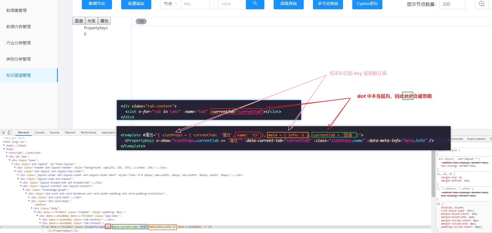
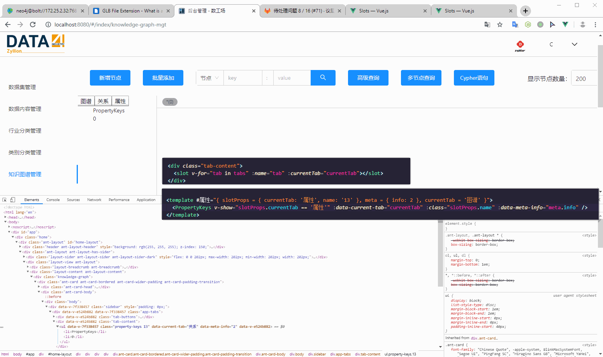
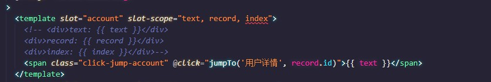

# slotProps





旧写法，Vue 2.6.0+ 后已不推荐这样写了。



```html
<template>
  <div id="team">
    <slot name="产品研发" :team="'产品研发'"></slot>
    <slot name="数据源" :team="'数据源'"></slot>
    <slot name="市场" :team="'市场'"></slot>
    <slot name="人事" :team="'人事'"></slot>
    <slot name="财务"></slot>
  </div>
</template>

<script>
export default {
  name: "Team",
}
</script>
```

```html
<template>
  <div id="department">
    <team>
      <template #产品研发="slotProps">
        <div :data-team="slotProps.team">{{ slotProps.team }}</div> <!-- <div data-team="产品研发">产品研发</div> -->
      </template>

      <template #数据源="slotProps">
        <div :class="slotProps.team">{{ slotProps.team }}</div> <!-- <div class="数据源">数据源</div> -->
      </template>

      <template #市场="{ team }">
        <div :class="team">{{ team }}</div> <!-- <div class="市场">市场</div> -->
      </template>

      <template #人事="{ team: 小组名称 }"> <!-- 给 team 起别名 -->
        <div :class="小组名称">{{ 小组名称 }}</div> <!-- <div class="人事">人事</div> -->
      </template>

      <template #人事="{ team = { name: '周' } }"> <!-- slotProps 为 undefined 时，给默认值 -->
        <div :class="team.name">{{ team.name }}</div> <!-- <div class="周">周</div> -->
      </template>
    </div>
  </div>
</template>

<script>
import Team from "./Team";

export default {
  name: "Department",
  components: {
    Team,
  }
}
</script>
```

https://vuejs.org/v2/guide/components-slots.html#Scoped-Slots

解构、默认值

https://vuejs.org/v2/guide/components-slots.html#Destructuring-Slot-Props