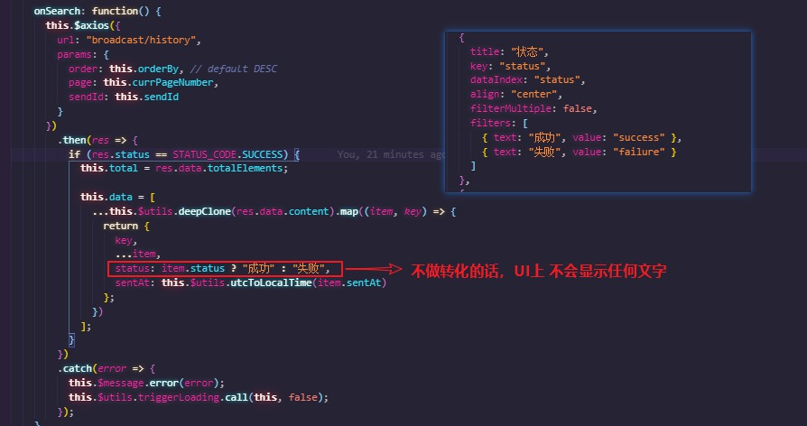

# table status 不做转换 UI 不显示任何文字

```js
columns: [
  {
    title: "状态",
    key: "status",
    dataIndex: "status",
    align: "center",
    filterMultiple: false,
    filters: [
      { text: "成功", value: "success" },
      { text: "失败", value: "failure" }
    ]
  }
]

...

this.data = [
  ...this.$utils.deepClone(res.data.content).map((item, key) => {
    return {
      key,
      ...item,
      status: item.status ? "成功" : "失败", // 不做转化 UI 不会显示任何文字
      sentAt: this.$utils.utcToLocalTime(item.sentAt)
    };
  })
];
```

