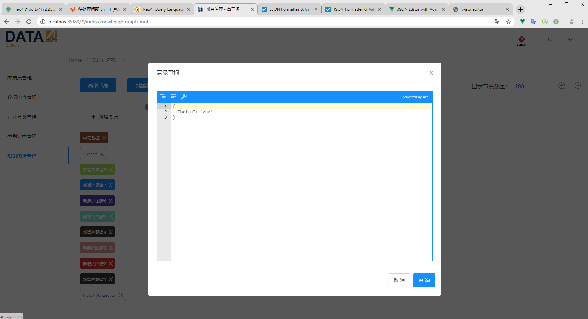

# v-jsoneditor

- plus="true" 全屏。
- options: {  } 阅读模式。
- height 值需为 '1px' 的形式。

```bash
# install
yarn add v-jsoneditor or npm install v-jsoneditor

# usage

<template>
  <v-jsoneditor v-model="json" :options="options" :plus="false" :height="'400px'" @error="onError">
</template>

<script>
import VJsoneditor from 'v-jsoneditor/src/index'

export default {
    name: 'app',
    components: {
        VJsoneditor
    },
    data() {
        return {
            json: {
                'hello': 'vue'
            },
            options: {
              mode: 'code' // 注释后变为 JSON 阅览器
            },
        }
    },
    methods: {
        onError() {
            console.log('error')
        }
    }
}
</script>
```



https://vuejsexamples.com/json-editor-with-vue-js/

https://yansenlei.github.io/VJsoneditor/