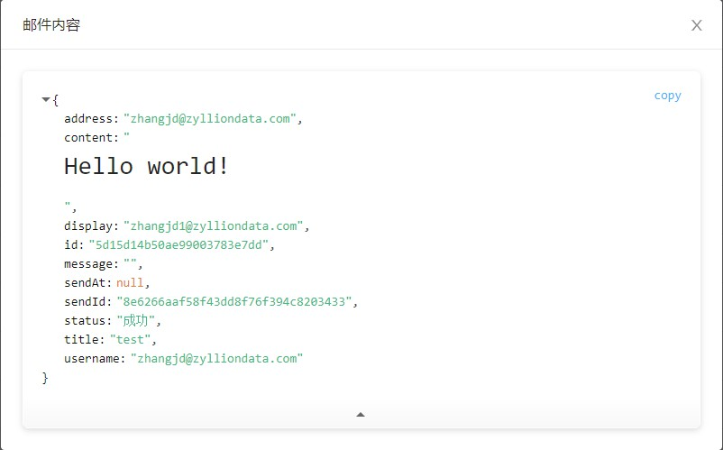

# vue-json-viewer

```bash
# install dependency
$ yarn add vue-json-viewer
```

```vue
<template>
  <div>
    <json-viewer :value="jsonData"></json-viewer>

    <hr/>

    <json-viewer
      :value="jsonData"
      :expand-depth=5
      copyable
      boxed
      sort
    >
    </json-viewer>
  </div>
</template>

<script>
import Vue from 'vue'
import JsonViewer from '../lib'

Vue.use(JsonViewer)

export default {
  name: "sample"
}

</script>
```

### 完成效果



地址：

- [vue-json-viewer](https://vuejsexamples.com/simple-json-viewer-component-for-vue-js/)
- [vue-json-viewer - github](https://github.com/chenfengjw163/vue-json-viewer)