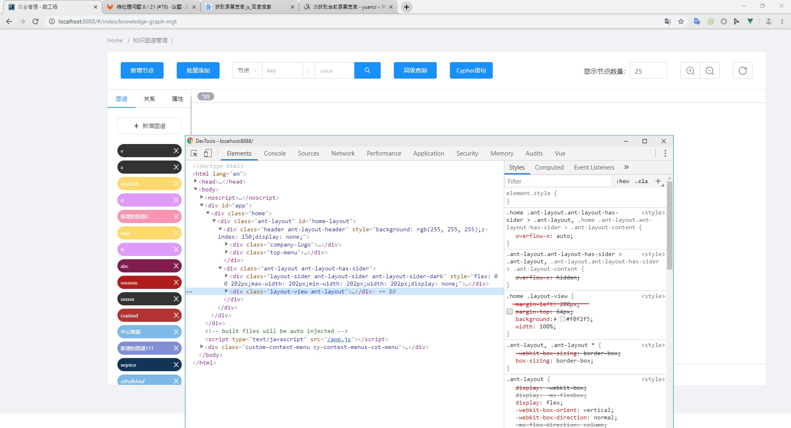

# 知识图谱管理全屏

```js
toggleFullScreen() {
  this.fullscreenEleDataType = this.$utils.dataType(document.fullscreenElement);

  if (!document.fullscreenElement) {
    document.documentElement.requestFullscreen();

    const style = document.createElement("style");
    style.id = "fullscreen";

    const screenHeight = window.screen.height;

    style.innerHTML = `
      .home .header { display: none; }

      .layout-sider.ant-layout-sider.ant-layout-sider-dark { margin-top: 0; display: none; }

      .layout-view.ant-layout { margin-top: 0; margin-left: 0; }

      .layout-breadcrumb.ant-breadcrumb { display: none; }

      .layout-footer.ant-layout-footer { display: none; }

      .layout-content.ant-layout-content { margin: initial !important; min-height: initial !important; width: initial !important; }

      .ant-layout.ant-layout-has-sider { height: ${screenHeight}px; }

      .sidebar { height: ${screenHeight - 95}px !important; }

      .knowledge-graph .body { height: initial !important; }

      .content.graph p.node-info { top: initial !important; bottom: 0; }

      .content.graph div.node-info { top: initial !important; bottom: 0; }
    `;

    document.head.appendChild(style);
  } else {
    if (document.exitFullscreen) {
      document.exitFullscreen(); 

      const fullscreen = document.querySelector("#fullscreen");
      document.head.removeChild(fullscreen);
    }
  }
}
```





