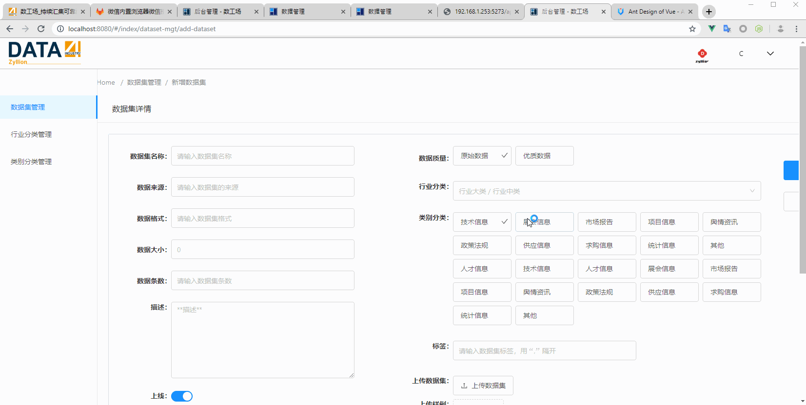
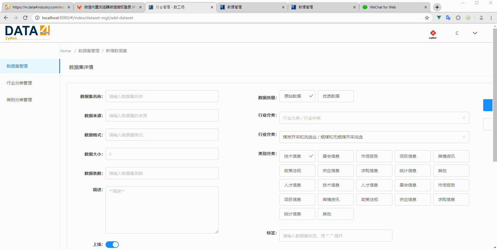

# 级联选择

## changeOnSelect



```vue
<template>
  <a-cascader
    :options="options"
    @change="onChange"
    placeholder="行业大类 / 行业中类"
    style="width: 632px;"
    changeOnSelect
  />
</template>
```

## 回显 / 默认值

```vue
<template>
  <a-cascader
    :options="options"
    @change="onChange"
    placeholder="行业大类 / 行业中类"
    style="width: 632px;"
    changeOnSelect
    :defaultValue="['煤炭开采和洗选业', '烟煤和无烟煤开采洗选']"
  />
</template>
<script>
export default {
  data() {
    return {
      options: [
        {
          value: "煤炭开采和洗选业",
          label: "煤炭开采和洗选业",
          children: [
            {
              value: "烟煤和无烟煤开采洗选",
              label: "烟煤和无烟煤开采洗选"
            },
            {
              value: "褐煤开采洗选",
              label: "褐煤开采洗选"
            },
            {
              value: "其他煤炭采选",
              label: "其他煤炭采选"
            }
          ]
        }
      ]
    }
  }
}
</script>
```

https://vue.ant.design/components/cascader/#components-cascader-demo-default-value

## 使用组件



### 有默认值

```vue
<!-- AppCascader.vue -->
<template>
  <a-cascader
    :options="options"
    @change="onChange"
    placeholder="行业大类 / 行业中类"
    style="width: 632px;"
    changeOnSelect
    :defaultValue="defaultValue"
  />
</template>
<script>
export default {
  name: "AppCascader",
  props: {
    options: {
      type: Array,
      require: true
    },
    defaultValue: {
      type: Array,
      default() {
        return [];
      }
    }
  },
  methods: {
    onChange(value) {
      this.$emit("updateSelection", value);
    }
  }
};
</script>
```

```vue
<!-- AddDataset.vue -->
<template>
  <div>
    <AppCascader
      :options="options"
      @updateSelection="updateSelection"
      :defaultValue="defaultValue"
    />
  </div>
</template>

<script>
export default {
  data() {
    return {
      defaultValue: ['6', '61'],
      options: [
        {
          value: "6",
          label: "煤炭开采和洗选业",
          children: [
            {
              value: "61",
              label: "烟煤和无烟煤开采洗选"
            },
            {
              value: "62",
              label: "褐煤开采洗选"
            },
            {
              value: "69",
              label: "其他煤炭采选"
            }
          ]
        }
      ]
    }
  },
  methods: {
    updateSelection(name) {
      console.log(name)
    }
  }
}
</script>
```

### 无默认值

```vue
<!-- AppCascader.vue -->
<template>
  <a-cascader
    :options="options"
    @change="onChange"
    placeholder="行业大类 / 行业中类"
    style="width: 632px;"
    changeOnSelect
    :defaultValue="defaultValue"
  />
</template>
<script>
export default {
  name: "AppCascader",
  props: {
    options: {
      type: Array,
      require: true
    },
    defaultValue: {
      type: Array,
      default() {
        return [];
      }
    }
  },
  methods: {
    onChange(value) {
      this.$emit("updateSelection", value);
    }
  }
};
</script>
```

```vue
<!-- AddDataset.vue -->
<template>
  <div>
    <AppCascader
      :options="options"
      @updateSelection="updateSelection"
    />
  </div>
</template>

<script>
export default {
  data() {
    return {
      options: [
        {
          value: "6",
          label: "煤炭开采和洗选业",
          children: [
            {
              value: "61",
              label: "烟煤和无烟煤开采洗选"
            },
            {
              value: "62",
              label: "褐煤开采洗选"
            },
            {
              value: "69",
              label: "其他煤炭采选"
            }
          ]
        }
      ]
    }
  },
  methods: {
    updateSelection(name) {
      console.log(name)
    }
  }
}
</script>
```