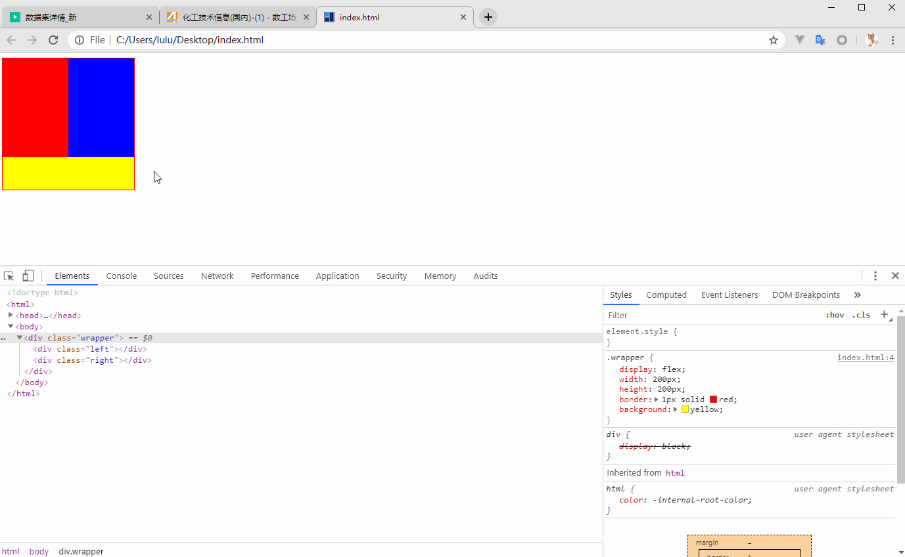

# 右边宽度固定左边宽度自适应的css布局



```html
<!DOCTYPE html>
<head>
  <style>
    .wrapper {
      display: flex;
      width: 200px;
      height: 200px;
      border: 1px solid red;
      background: yellow;
    }

    .left {
      flex: 1;
      height: 150px;
      background: red;
    }

    .right {
      float: right;
      background: blue;
      width: 100px;
      height: 150px;
    }
  </style>
</head>
<body>
  <div class="wrapper">
    <div class="left"></div>
    <div class="right"></div>
  </div>
</body>
</html>
```

https://blog.csdn.net/weixin_34364979/article/details/79476865