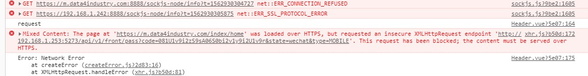

# 微信内置浏览器微信登录

## 微信网页授权

如果用户在微信客户端中访问第三方网页，公众号可以通过微信网页授权机制，来获取用户基本信息，进而实现业务逻辑。

https://mp.weixin.qq.com/wiki?t=resource/res_main&id=mp1421140842

[微信开发网页授权的两种方式](https://blog.csdn.net/coreyc/article/details/81098014)
[微信OAuth授权获取用户OpenId](https://www.cnblogs.com/zxshuai/p/4223331.html)
[微信登录(授权登录、扫码登录、静默登录)简述](https://blog.csdn.net/qq_38746645/article/details/77095058)

## 测试号管理 ( 得是服务号，不能为订阅号 )

季公子

appid: wxa09f0d3d917f3238

appsecret: be2527a3ce13b0c167de2704c848a15c

[测试号管理](http://mp.weixin.qq.com/debug/cgi-bin/sandboxinfo?action=showinfo&t=sandbox/index)
[微信订阅号和服务号的区别是什么](https://jingyan.baidu.com/article/6fb756ec74193b241958fb49.html)

## UnionID 机制

在开放平台账号中绑定微信服务号后，微信内置浏览器获取的 code 拿到的 userInfo 中就会包含 unionID

[微信扫码登录取得的openid与网页授权获得的openid不同](http://blog.sina.com.cn/s/blog_70e50f090102x6yk.html)

## 明浩接口 block

接口需要是 https 协议的



## 采用

```js
// Header.vue
methods: {
  loginViaWechat() {
    const appid = "wxa09f0d3d917f3238";
    const redirect_uri = "https%3A%2F%2Fm.data4industry.com%2Foauth%2Flogin";
    const response_type = "code";
    const scope = "snsapi_userinfo";
    const state = "wechat";
    const url = `https://open.weixin.qq.com/connect/oauth2/authorize?appid=${appid}&redirect_uri=${redirect_uri}&response_type=${response_type}&scope=${scope}&state=${state}#wechat_redirect`;

    localStorage.setItem("redirect_uri", location.href);

    window.open(url);
  }
}
```

```js
// WXLogin.vue
mounted() {
  this.query = this.$route.query;

  this.$axios({
    method: "GET",
    url: `http://192.168.1.253:5273/api/v1/front/pass`,
    params: {
      code: this.$route.query.code,
      state: this.$route.query.state,
      type: "MOBILE"
    }
  })
    .then(res => {
      localStorage.setItem("token", res.data);

      location.href = localStorage.getItem("redirect_uri");
    })
    .catch(error => {
      this.$Message.error(error.response.data.message);
    });
}
```