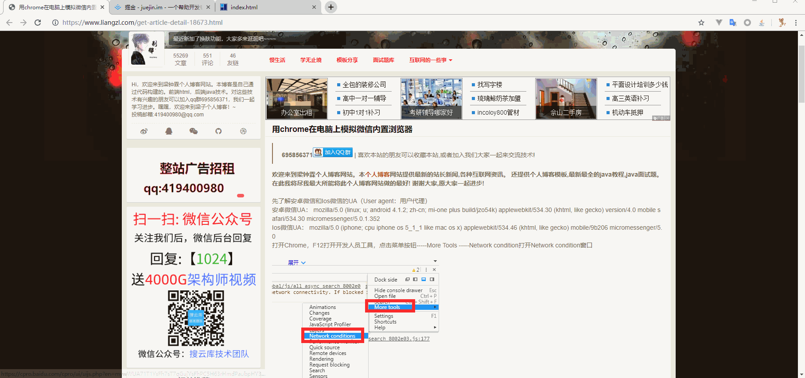

# 用chrome在电脑上模拟微信内置浏览器

安卓 UA：
mozilla/5.0 (linux; u; android 4.1.2; zh-cn; mi-one plus build/jzo54k) applewebkit/534.30 (khtml, like gecko) version/4.0 mobile safari/534.30 micromessenger/5.0.1.352

IOS UA：
mozilla/5.0 (iphone; cpu iphone os 5_1_1 like mac os x) applewebkit/534.46 (khtml, like gecko) mobile/9b206 micromessenger/5.0 



```html
<!DOCTYPE html>
<head>
</head>
<body>
  <script>
  window.onload = function() {
    isWeixinBrowser();
  }

  // 判断是否微信浏览器
  function isWeixinBrowser() {  
    var ua = navigator.userAgent.toLowerCase();  
    var result = (/micromessenger/.test(ua)) ? true : false;
    if (result) {
      console.log('你正在访问微信浏览器');
    } else {
    console.log('你访问的不是微信浏览器');
    }
    return result;
  }  
  </script>
</body>
</html>
```

掘金 url

https://open.weixin.qq.com/connect/oauth2/authorize?appid=wxe460819ccff0f83e&redirect_uri=https%3a%2f%2fjuejin.im%2foauth%2flogin&response_type=code&scope=snsapi_userinfo&state=wechat_mobile&connect_redirect=1#wechat_redirect

- https://www.liangzl.com/get-article-detail-18673.html
- https://zhidao.baidu.com/question/2076665830070796348.html