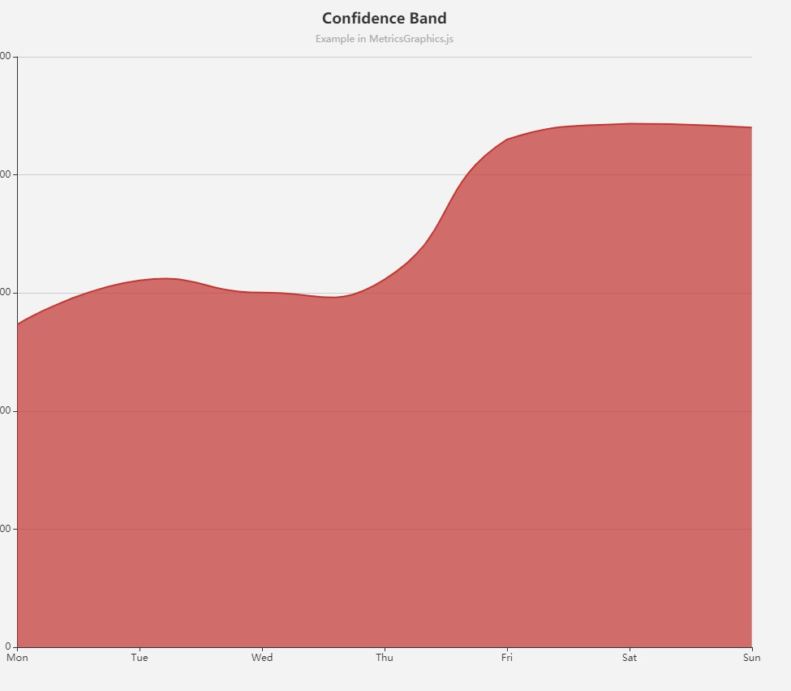

# echarts



```js
// 2019年8月26日13:32:07
option = {
    title: {
        text: '周积分统计图',
        // subtext: 'Example in MetricsGraphics.js',
        left: 'center'
    },
    xAxis: {
        type: 'category',
        boundaryGap: false,
        data: [1, 2, 3, 4, 5, 6, 7, 8, 9, 10, 11, 12],
        axisLine: {
            show: false
        },
        axisLabel: {
            textStyle: {
                color: "#999999",
            }
        }
    },
    yAxis: {
        type: 'value',
        splitLine:{
            show:false,
        },
        axisLine: {
            show: false
        },
        axisLabel: {
            textStyle: {
                color: "#999999",
            }
        }
    },
    series: [{
        data: [16, 20, 40, 60, 72, 76, 68, 49, 40, 30, 24, 20],
        type: 'line',
        smooth: true,
        symbol: "none",
        areaStyle: {
            normal: {
                color: ["#B0D2F4"]
            }
        },
        itemStyle: {
            color: ["transparent"]
        },
    }]
};

```

https://www.cnblogs.com/hellman/p/8135051.html

https://gallery.echartsjs.com/editor.html?c=x_iPv4Uz9b

https://gallery.echartsjs.com/editor.html?c=xEyDk1hwBx